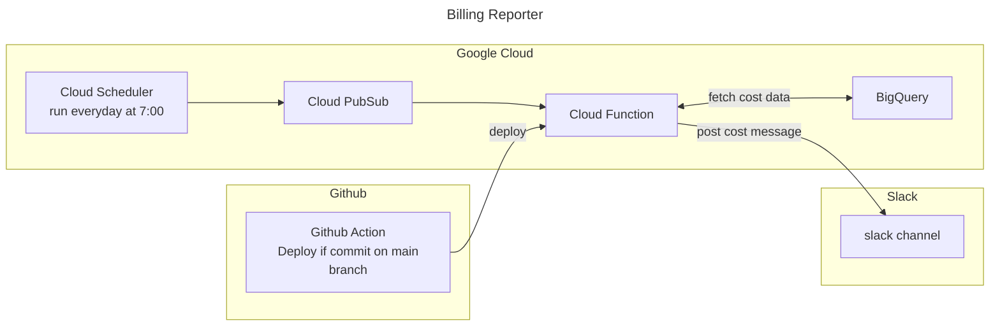

# Billing Reporter

## Google Cloud Architecture




## Directory

```sh
.
├── README.md
├── .github/workflows/
├── src/
└── terraform/
```

- `src`: Source of Billing Reporter, which is written by Python.
- `terraform`: Manage infrastructure,  google cloud, github, terraform cloud. Those are managed by IaC, terraform.
- `.github/workflows`: Github Action. Now, there are Lint-CI and Billing Reporter Deployment which is deployed to Google Cloud.
