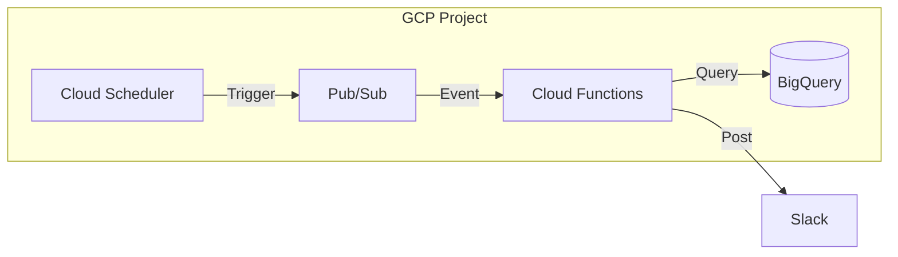

# GCP Billing Reporter

GCPの利用料金を集計し、毎日Slackに通知するサーバーレスアプリケーションです。
Terraformによるインフラ管理と、GitHub Actionsによる自動デプロイ（Cloud Functions）を組み合わせて構築されています。

## ✨ 機能

- **毎日のコスト通知:** 毎日朝 5:00 (JST) に自動実行されます。
- **詳細な内訳:** 直近2週間のコストをサービスごとに集計して表示します。
- **差額の可視化:** 前日と比較したコストの増減を確認できます。
- **Serverless:** Cloud Scheduler, Pub/Sub, Cloud Functions, BigQuery を使用したフルマネージドな構成です。

## 🏗 アーキテクチャ


```mermaid
graph LR
    Scheduler[Cloud Scheduler] -->|Trigger| PubSub[Pub/Sub]
    PubSub -->|Event| CF[Cloud Functions]
    CF -->|Query| BQ[(BigQuery)]
    CF -->|Post| Slack[Slack]

    subgraph GCP Project
        Scheduler
        PubSub
        CF
        BQ
    end
```

## 🚀 セットアップ

### 1. 前提条件

- GCPプロジェクトが作成されていること
- 課金管理者権限を持っていること（Billing Exportの設定に必要）
- Terraform が実行できる環境（Terraform Cloud 推奨）
- SlackのIncoming Webhook URLが発行されていること

### 2. インフラ構築 (Terraform)

`terraform/` ディレクトリには、必要なGCPリソースを構築するためのコードが含まれています。

主なリソース:

- BigQuery Dataset (`all_billing_data`)
- Cloud Pub/Sub Topic
- Cloud Scheduler Job
- Service Accounts & IAM
- Secret Manager (Slack Webhook URL, Billing Account ID)

**必要なTerraform変数 (`variables.tf` 参照):**

- `gcp_project_id`: GCPプロジェクトID
- `gcp_default_region`: デフォルトリージョン (例: `asia-northeast1`)
- `gcp_billing_reporter_slack_webhook_url`: SlackのWebhook URL
- `gcp_billing_reporter_billing_account_id`: 請求アカウントID

Terraformを適用後、GCPコンソールの「お支払い」→「課金データのエクスポート」から、作成されたBigQueryデータセット (`all_billing_data`) へのエクスポートを設定してください。

### 3. アプリケーションのデプロイ (GitHub Actions)

`app/` ディレクトリのアプリケーションコードは、GitHub Actions経由でデプロイされます。
リポジトリの Settings > Secrets and variables > Actions に以下の変数を設定してください。

| 変数名 | 説明 |
| --- | --- |
| `GCP_PROJECT_ID` | デプロイ先のGCPプロジェクトID |
| `GH_GCP_WORKLOAD_IDENTITY_PROVIDER` | Workload Identity Provider のリソース名 |
| `GH_GCP_SERVICE_ACCOUNT` | GitHub Actionsが使用するGCPサービスアカウント |
| `BILLING_REPORTER_GCP_SERVICE_ACCOUNT` | Cloud Functions実行用サービスアカウント (Terraformで作成されたもの) |
| `BILLING_REPORTER_PUBSUB_TOPIC` | トリガーとなるPub/Subトピック名 (例: `projects/<PROJECT>/topics/billing_reporter`) |

## 💻 ローカル開発

Pythonのパッケージ管理には [uv](https://github.com/astral-sh/uv) を使用しています。

### インストール

```bash
cd app
uv sync
```

### ローカル実行

環境変数を設定して実行します。

```bash
export SLACK_WEBHOOK_URL="your-webhook-url"
export BILLING_ACCOUNT_ID="your-billing-account-id"
export GOOGLE_CLOUD_PROJECT="your-project-id"

# ローカルでの実行（メイン関数のテストなど）
make run-local
```

## 📂 ディレクトリ構成

```text
.
├── .github/workflows/ ... CI/CD パイプライン定義
├── app/ ................. Cloud Functionsのソースコード (Python)
│   ├── main.py .......... エントリーポイント
│   └── sql/ ............. BigQuery用SQLクエリ
└── terraform/ ........... インフラ構成コード (HCL)
```
